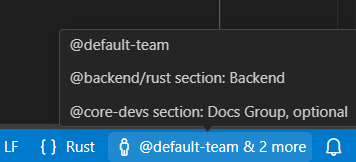
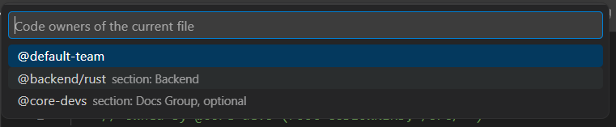
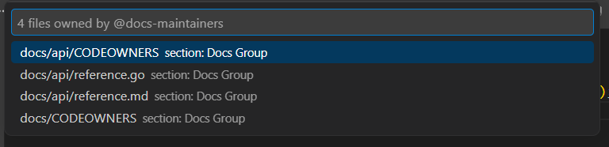

# GitLab CODEOWNERS for VS Code

VS Code extension with support for [GitLab CODEOWNERS](https://docs.gitlab.com/ee/user/project/codeowners/) files.

## Features

- **File type detection** — `CODEOWNERS` files are recognized as `codeowners` language, so formatting and linting tools (e.g. ESLint with a custom parser) can be configured to validate them via `eslint.validate`.
- **Syntax highlighting** — highlights sections `[Section]` (including optional `^[Section]`), patterns, owners (`@user`, `@group/subgroup`, emails), optional owners and approval counts.
- **Status bar** — shows the code owners of the currently open file. Hover to see details (section, optional). Click to open a quick pick with all owners (selecting one copies its name to the clipboard).

  

- **Section folding** — sections fold from their header to the next section; trailing blank lines and comments stay visible so they remain attached to the section that follows.
- **GitLab search semantics** — [search paths](https://docs.gitlab.com/ee/user/project/codeowners/#codeowners-file-location): `CODEOWNERS`, `docs/CODEOWNERS`, `.gitlab/CODEOWNERS`; patterns, sections, and optional/hidden sections follow GitLab's matching rules (last match wins, section composition).

Zero runtime dependencies — parsing is done in-house, without `@gitlab/codeowners`.

## Commands

| Command                                          | Description                                                  |
| ------------------------------------------------ | ------------------------------------------------------------ |
| `GitLab CODEOWNERS: Show owners of current file` | Quick pick list of all code owners for the active file       |
| `GitLab CODEOWNERS: Search files by owner`       | List all files owned by a given owner (user, group or email) |

### Show owners of current file



### Search files by owner



## Development

```bash
npm install
npm run compile   # type check + bundle (vite, CJS single file)
npm test          # vitest unit tests
npm run lint      # oxlint
npm run fmt       # oxfmt
npm run package   # build for publishing
```

## License

[MIT](LICENSE)
